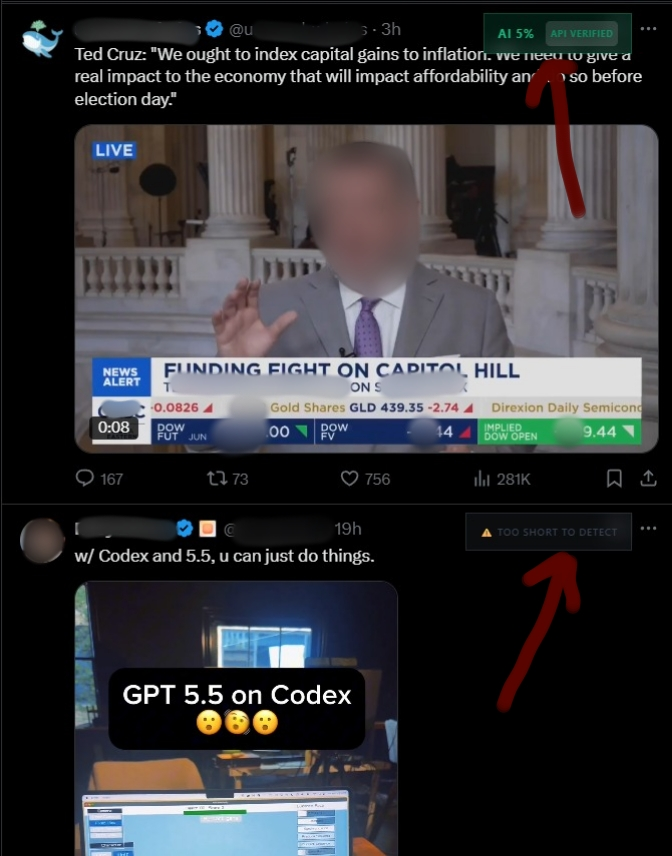
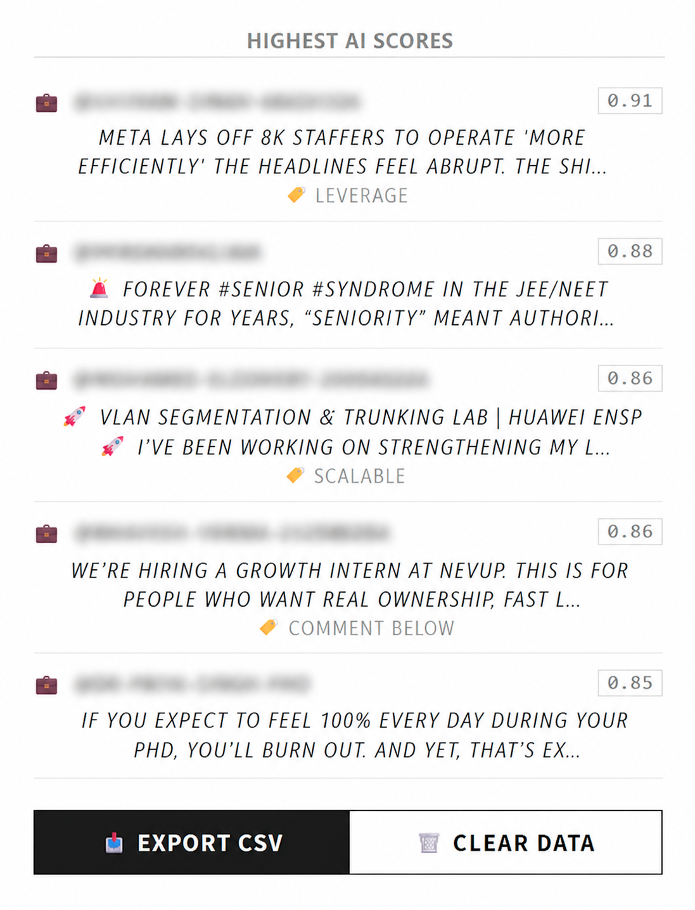
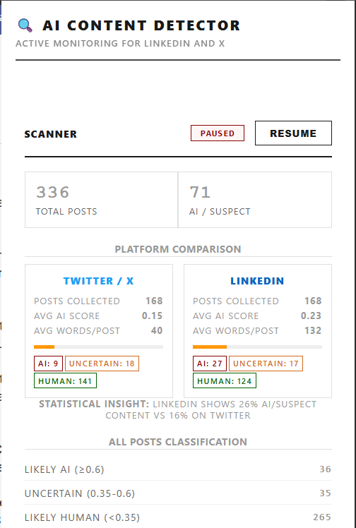

# AI Content Detector

A Chrome extension and backend for spotting AI-generated posts on LinkedIn and X. Uses the Sapling API to classify posts in real time by monitoring feeds as scroll.

---

## Screenshots

| Feed Scan | Post Scan |
| :---: | :---: |
|  |  |
| **Highest Scores Database** | **The Dashboard** |
|  |  |

---


## Tech Stack

- **Frontend**: Vanilla JS and CSS
- **Backend**: Cloudflare Workers (serverless)
- **Database**: Cloudflare D1 (SQL)
- **API**: Sapling.ai (AI Detection)

---

## What It Does

Classification happens in two stages. First, the local heuristic engine runs instantly in the browser with no API call. Simultaneously, *every* valid post (over 20 words) gets queued for the Sapling API to score more precisely. The badge updates in place when the API result comes back.

### Local Heuristic Engine

Built into `detector.js`, runs offline on every post before anything hits the API. It checks 13 signals and combines them into a score between 0 and 1:

| Signal | What it looks for |
|---|---|
| General buzzwords | "delve", "tapestry", "paradigm shift", "holistic approach", etc. |
| LinkedIn-specific phrases | "here's what I learned", "hot take", "unpopular opinion", "proud to announce" |
| Corporate speak | "leverage", "synergy", "empower", "actionable insights", "spearhead" |
| Burstiness | Humans write with uneven sentence lengths. AI writes uniformly — every sentence ~15-25 words. Low standard deviation = AI signal. |
| Type-Token Ratio | AI actively avoids repeating words. Suspiciously high vocabulary diversity is flagged. |
| LinkedIn structure | Short punchy hook line followed by longer content, lots of single-line paragraphs ("broetry") |
| Numbered/bullet lists | Especially emoji lists (🔹, 💡, 🎯) — a strong LinkedIn AI pattern |
| Engagement bait | Starts with a hook and ends with "thoughts?", "share if you agree", "tag someone" |
| Emoji patterns | Strategic single emoji per line is common in AI posts. Emoji clusters are more human. |
| Human signals | Slang, typos, casual tone, emoji clusters reduce the score |
| Formal language | "furthermore", "in conclusion", "needless to say", etc. raise the score |
| Repetition patterns | Anaphora (consecutive sentences starting same word), heavy transition word usage, tricolon structures |
| Length bonus | Posts over 150 words get a small bump. Over 300 words a larger one. |

Thresholds: `≥ 0.6` = Likely AI, `0.35–0.6` = Uncertain, `< 0.35` = Likely Human.

Posts under 20 words are skipped entirely and get a gray "Too short to detect" badge.

### The Processing Pipeline (Flow & Queue)

Handling 1,500 participants hitting an external API requires strict queueing and fallback logic:

1. **Two-Stage Flow**: Every post (over 20 words) is instantly evaluated by the Local Heuristic Engine, and a badge is injected immediately so the user isn't kept waiting. Simultaneously, *every* valid post is pushed to the API queue for the Sapling API to generate a highly accurate score, which updates the badge once verified.
2. **LIFO Queue**: Instead of a standard first-come-first-served queue, we use **LIFO** (last-in, first-out). The post you're currently looking at on-screen gets classified first. If you scroll fast, you won't wait 15 seconds for old, off-screen posts to clear the queue before the current one is checked.
3. **Rate Limiting**: To prevent API throttling, the queue processor enforces a strict 800ms delay between calls.
4. **Exponential Backoff & Fallback**: If an API call fails or times out (15s limit), it automatically retries up to 5 times with an increasing delay.
5. **Hybrid Scoring Algorithm**: Once a result is received, the system uses a weighted formula: `Final Score = (Local * 0.3) + (API * 0.7)`. This ensures accuracy while retaining local signal context.
6. **Seamless Fallback**: If all retries fail, the system falls back to the Local Heuristic score so the user experience is never interrupted.

### SPA Navigation Support

Handles single-page apps properly. When you switch from the Notifications tab to your feed on LinkedIn without refreshing, the extension detects the URL change, waits for the new DOM to settle, and reattaches the observer. No need to reload the page manually.

### Scanner Toggle

Pause and resume detection in real time from the popup dashboard. State persists across page refreshes — if you paused it, it stays paused until you manually resume.

### Data Persistence

Two layers:
- **Local dashboard** — real-time stats per user, with a CSV export button
- **Central database** — every detection automatically streams to Cloudflare D1 for the full study analysis

---

## Setup

### 1. Clone the Repository

```bash
git clone https://github.com/Arnab-iitkgp/ai-content-detector.git
cd ai-content-detector
```

### 2. Backend

```bash
cd worker
npm install

# Initialize the local database
npx wrangler d1 execute ai_content_detector_research --local --file=schema.sql

# Add your Sapling API key
echo 'SAPLING_API_KEY="your_key_here"' > .dev.vars

# Start the dev server
npx wrangler dev
```

Worker runs on `http://127.0.0.1:8788` by default.

### Chrome Extension

1. Go to `chrome://extensions`
2. Turn on **Developer mode** (top right toggle)
3. Click **Load unpacked** and select the `extension` folder
4. Pin it to your toolbar

---

## Usage & Research Workflow

1. **Resume the Scanner**: Open the extension popup and ensure the status is **ACTIVE**. If it says PAUSED, click **RESUME**.
2. **Allow Permissions**: When you first visit LinkedIn or X, the browser may show a prompt saying *"wants to access other apps and services on this device"*. Click **Allow** - this is required for the extension to send post text to the backend worker for API-based AI detection.
   <br>
3. **Scan Feeds**: Visit [linkedin.com](https://www.linkedin.com) or [x.com](https://x.com) and scroll through your feed normally.
4. **Post Expansion**: The extension automatically clicks **"...more"** on truncated LinkedIn posts to capture the full text before scoring. No manual action needed.
5. **Detection**: "API Verified" badges will appear on posts as the system processes them.
6. **Data Review**: Open the popup dashboard at any time to see aggregated stats and the highest AI scores captured.
7. **Zero-Data Safe**: The dashboard works even with no posts captured — it will guide you to start scanning.

---

## Research Data Collection

### Central Database Queries
To view the aggregated data collected from all detections, run:
```bash
npx wrangler d1 execute ai_content_detector_research --local --command="SELECT platform, author_handle, ai_score, content_text FROM detections ORDER BY created_at DESC LIMIT 20"
```

### Exporting User Data
Users can click **"Export CSV"** in the popup dashboard to download their specific session data.

---


## Deploying for the Full Study

When moving from local testing to the actual study:
1. **Cloud DB**: Run `npx wrangler d1 create ai_content_detector_research` and update the ID in `wrangler.toml`.
2. **Deploy**: Run `npx wrangler deploy`.
3. **Endpoint**: Update `extension/scripts/api.js` with your live `.workers.dev` URL.
4. **Secret**: Run `npx wrangler secret put SAPLING_API_KEY`.
